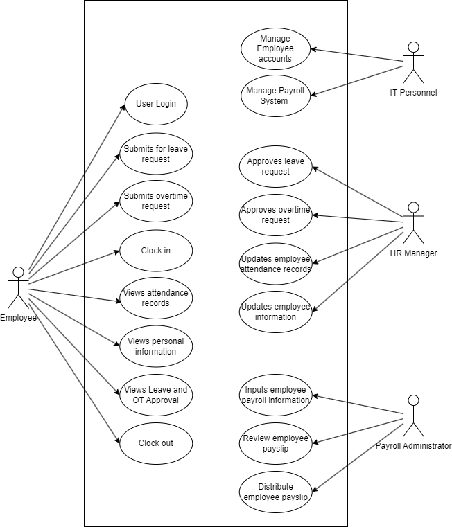

# MO-IT110 - Terminal Assessment: MotorPH Payroll System Documentation A2101 Dymosco, P., Gernale, G., Rivera, R.
#### Prerequisites: JRE (Java Runtime Environment)

## Introduction

This document will discuss the payroll system that is created for employees of Motor PH to view or manage their data or salary within the company. It is also where the HR manager or IT department will input or manage the employee data being stored in this system. This application is created for employees who have trouble accessing their info when they work for Motor PH so that’s why this interface is created not just to store their data but also to request leave or overtime when they work for the company. 

### User Roles

The users who will use this application will be the employees who can view their data and the HR manager and IT who are in charge of managing and editing the employee data inputted in the payroll system. The employee can also send a request for leave or overtime within the app and the HR manager is in charge if they choose to accept or reject any of the requests received by their employees.

### Navigating the User Guide

This is how the user can navigate through the system/application for MotorPH:

* Employees need to sign in with a designated username and password to confirm they work in Motor PH whether they are an employee or HR manager. 
*  The user/employee has access to the self-service portal to access the attendance history, employee data, requests for leave, and other information within the system
* HR manager and IT department can manage and edit the employee data or calculations to be stored in the payroll system.

## Getting Started 
This section covers the prerequisites for using the payroll system. It includes hardware, software, and access guides essential for MotorPH employees and other stakeholders to ensure a smooth process. The hardware prerequisites will outline the necessary specifications for seamless system operation. Similarly, the software requirement specifications will ensure compatibility. Lastly, the access guides will orient users to the payroll system and its functionalities.

### Hardware Prerequisites
The payroll system will require hardware specifications to ensure smooth functionality, where the hardware can handle the necessary load the payroll system will put on it. This Hardware specification will be required from the stakeholders to ensure a smooth operation.

* Minimum Requirements: 

    * Processor: Dual-Core / Four-Threads CPU clocked @ 2.0ghz 64-bit (Preferably released no later than 2012)
    * RAM: 8gb DDR3 1800mhz/ DDR4 2400mhz
    * Storage: 256gb SSD 
    * Graphics: Integrated Graphics

* Recommended Requirements: 

    * Processor: Quad-Core CPU clocked at 3.0ghz 64-bit (Preferably released no later than 2012)
    * RAM: 16gb DDR3 1800mhz/ DDR4 2400mhz
    * Storage: 256gb SSD
    * Graphics: Integrated Graphics

### Software Prerequisites
The payroll system will require software specifications to ensure smooth functionality, where the software is compatible with the programming language used by the payroll system. This Software specification will be required from the stakeholders to ensure a smooth operation.

* Windows: Any Windows x64 version (Win 7, 8, 8.1, 10, 11 x64)
* MacOS: Any MacOS or MacOSX version that supports Java
* Linux: Any Linux distro that supports Java

The Payroll System is dependent on Java, a crucial programming language, for its operation. Developed entirely in Java, without it, any operating system would be unable to execute the program. Thus, having a JRE (Java Runtime Environment) installed is an essential prerequisite for running the Payroll System.

### Accessing the System
A documentation website will be provided to MotorPH and its stakeholders, On this website, all necessary instructions, prerequisites, and instructions will be documented for the intended users to understand the functionalities of the system properly. On this website, a link is also provided, this link will serve as the download link for the payroll system.

Within the files of the system, is located the “Login Accounts.csv”, this file contains all the Login credentials for the MotorPH employees, including non-managerial MotorPH Employees, HR Employees, Payroll Employees, and IT Employees. With this file, all employees will be facilitated by the payroll system with features that cater to their role in MotorPH.

## Using the Payroll System

The software must manage employee information, track time and attendance, and calculate salaries accurately. It should prioritize secure account authentication with multi-factor and biometric options. The system must generate detailed reports for employee performance and financial insights. Additionally, it must comply with tax regulations, calculating taxable income and generating compliance reports. The focus is on a seamless user experience, data accuracy, and regulatory compliance in the payroll management system.

#### Employee Login Page

1. Employees can securely access the system using their unique email and password.
2. Enhanced user experience with a “Show Password” feature.
3. Role-based access control ensures security and privacy for Employees, HR Managers, Payroll Administrators, and IT Personnel.

#### Employee Home Page

1. Welcome interface with MotorPH logo.
2. Convenient navigation panel featuring Home, Account Profile, Attendance History, Leave Application, Overtime Request, Salary Print, and Sign Out options.

#### Employee Account Profile

1. Detailed display of personal information including Employee ID to Hourly Rate.
2. Empower employees to manage and update their personal details effortlessly.

#### Employee Attendance History

1. A comprehensive view of individual attendance records.
2. Easy filtering by month and quick access to complete attendance history.

#### Employee Leave Form

1. Streamlined leave request submission with options for Sick, Vacation, and Emergency leaves.
2. Real-time visibility of remaining leave credits and past leave history.

#### Employee Overtime Form

1. Effortless submission of overtime requests with flexibility in specifying hours.
2. Transparent overview of previous overtime requests and approvals.

#### Employee Salary

1. Access to salary details for any chosen month and year.
2. Ensures accuracy through final review by Payroll Administrator before distribution.

#### HR Home Page

1. Familiar interface with added functionality for managing employees.
2. Exclusive access to the “Manage Employee” feature for HR personnel.

#### HR Manage Employee

1. Centralized hub for HR to handle employee data including updates and approvals
2. Seamless management of leave requests, overtime requests, and employee records.

#### HR Leave Request Approval

1. Convenient overview of pending leave requests for approval or decline.

#### HR Overtime Request Approval

1. Convenient overview of pending overtime requests for approval or decline.

#### HR Manage Record

1. Restricted access for Payroll Admin and HR to view comprehensive employee data.

#### HR Create Employee

1. Empowers HR to efficiently manage employee information including addition, deletion, and updates.
2. Detailed table showcasing employee records for seamless administration.

#### Payroll Administrator Home Page

1. Similar layout to Employee Home Page with additional features for payroll management.
2. Exclusive access to “Access Payroll” and “View Employee” options for Payroll Admins.

#### Payroll View Employee

1. Secure platform for Payroll Admins to view detailed employee information.
2. Facilitates seamless transition ro payroll processing.

#### Payroll Management

1. Efficient salary calculation process with options for selecting employees and months.
2. Detailed breakdown of weekly salaries, gross earnings, deductions, and net salary.
3. Simplified payslip distribution process after finalizing salary checks.

#### IT Personnel Home Page

1. Similar layout to the Employee Home Page with additional features for account management.
2. Exclusive access to the “Create Account” feature for IT Personnel.

#### IT Create Account

1. Centralized platform for IT Personnel to manage employee accounts.
2. Authority to create, delete, and update accounts with role-based access control.

## Technical Information

This section provides details and diagrams on how the payroll system will function that will be elaborated in the form of tests and diagrams to show how it looks whether an employee or HR manager uses this interface. It will also show how it performed and documentation regarding the payroll system to see if it is fully functional and shows the process of storing and managing employee data within this system.

### Use Case Diagram

#### Use Case Scenario 1 - Employee Attendance: 

The employee attendance tracking system seamlessly records attendance. Directly interfacing with both the employee time clock and information management system, it logs each employee's attendance, ensuring accurate payroll processing.

1. Employees enter work and clock in with the company-issued employee time clock system.
2. The employee time clock system then interacts with the time and attendance module to update the attendance database with the time and date the employee clocks in.
3. During after-work hours, the employee again uses the employee time clock system to clock out of work.
4. The employee time clock system then interacts with the time and attendance module to update the attendance database with the time and date the employee clocks out.

#### Use Case Scenario 2 - Employee Information Management: 

The employee information management system mandates login credentials for MotorPH employees, enabling access to their data. HR Managers are given update/ edit access on the other hand. It serves as a central hub for the Attendance Tracking and Payroll Calculation modules' interaction.

1. The IT Personnel creates the employee with their own account and provides their login credentials. If forgotten, an employee can request the IT Personnel to retrieve their login information via email.
2. Upon logging in, the employee can view their information, this information is relevant to the calculation of their payroll. However, they can only view this information, any instances of editing are forbidden.
3. HR Managers will also be required to log in with their credentials. Upon logging in, they can view their information as well as other employee information. 
4. HR Managers can hover to a tab that allows them to edit and update employee information relevant to the payroll calculation.
5. HR Managers validate the information, if the presented information is not valid, they can edit this information.
6. Once validated, the HR Managers forward the information to the payroll administrators for calculation.

#### Use Case Scenario 3 - Payroll Calculation: 

The payroll calculation system/ module is one of the pivotal features of the payroll system. This allows for swift payslip calculation for all the MotorPH Employees.

1. Payroll Administrators are also required to log in with their credentials. Upon logging in they can view the validated information, and they are now able to conduct payroll calculations.
2. The payroll information is inputted into the calculation system for processing.
3. Once completed, the payroll administrator will validate the payslip for errors.
4. The Payroll Calculation module then interacts with the payroll distribution module.

#### Use Case Scenario 4 - Payroll Distribution:

The Payroll Distribution module/ system is the last step for the payroll system. This enables both the payroll administrator and other designated representatives to distribute the calculated and validated payslip to each MotorPH Employee.

1. The Payroll Administrator accesses this module within the payroll system.
2. The Payroll Distribution system then distributes the payslip to each employee of MotorPH.

### Class Diagram

The class diagram depicts a comprehensive overview of a system comprising five interconnected classes: Employee, Leave, Attendance, Deductions, and Salary. Each class encapsulates specific attributes and functionalities relevant to its role in the system. Employee serves as the central entity, with Deductions, Leave, Attendance, and Salary linked to it. Deductions, Leave, and Attendance, in turn, are intricately connected to the Salary class. The diagram showcases the relationships and dependencies among these classes, emphasizing the flow of information and computations within the system. Through this visual representation, the interplay between employee-related entities and their associated data types, such as double and string, is elucidated, offering a clear insight into the organizational structure and data interactions within the system.

### Testing

On March 14, Francis, Jomari, and our group worked together on Collaborative Testing, where we checked our project for any errors and discussed improvements. Then, on March 18, we had a session with our Subject Mentor for Object-Oriented Programming (OOP). We reviewed our code with the mentor's guidance, making necessary adjustments. The screenshots of our collaborative testing and the jamboard used during mentoring were instrumental in this process. These sessions were essential as they helped us refine our code and meet the project requirements more effectively.

Drive Link for the Screenshots
https://drive.google.com/drive/folders/1w_N0jDR4dLHk6HL4jgjccvXQYNA9mYYU?usp=sharing

#### Screenshots from the Testing:

