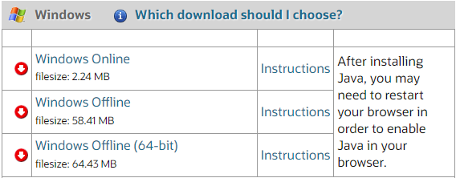
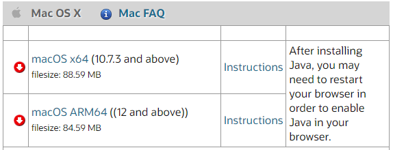
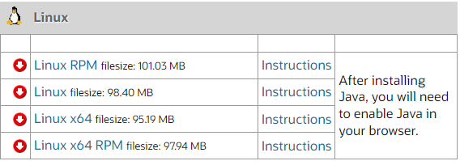

# Installing JRE (Java Runtime Environment)

JRE or Java Runtime Environment is an essential software that allows Java Programs to function properly. Java is a programming language used by web, mobile, and desktop applications today. JRE is an underlying technology that communicates between the Java Prgram and the operating system.

* Go to this [link](https://www.java.com/en/download/manual.jsp) and choose the appropriate version according to your operating system.

    * Windows:

    

    * MacOS X:

    

    * Linux:

    

## Installing JRE on Windows

Most modern machines will run on a x64 CPU (64-bit), so there is little to no problem in installing JRE. 

1. Click on the first link in the Windows option

2. Download it on your preferred path, this usually automatically selects the Download Folder as its destination. After downloading, you may double click on the "jre-8u401-windows-i586-iftw" file to proceed with the installation.

3. A dialogue box will appear asking for your confirmation on the install, click the "Install" button.

4. A progress window will appear, this shows the installation progress of the JRE. Let this progress finish.

5. Finally, another dialogue box will appear stating that Java has finally been installed in your system. And congrats, you have successfully installed Java in your PC!

## Installing JRE on Mac OS 

1. Click on the first link in the MacOS option if you are using an x64 (Intel) based Mac Device

2. Click on the second link in the MacOS option if you are using an ARM (M1, M2, M3) based Mac Device

3. A dialogue box will appear asking for your confirmation on the download and download path, click ok.

4. Once the download is finished, double click the downloaded file, a dialogue box opening the file will appear, wait for this to finish, and another confirmation prompt will appear, click open.

5. A dialogue box asking for your device password will appear, enter your password and then click ok.

6. A dialogue box will appear asking for your confirmation on the install, click the "Install" button.

7. A progress window will appear, this shows the installation progress of the JRE. Let this progress finish.

8. Finally, another dialogue box will appear stating that Java has finally been installed in your system. And congrats, you have successfully installed Java in your Mac Device!

## Installing JRE on Linux

Installing Java on Linux may vary on your desired distro (distribution), and there are also different ways to install Java or JRE. 
 
* It is possible to install Java on your linux device using console commands, these do not require .rpm files 

* It is also possible to install Java on your linux device using package managers such as yum, rpm, or dnf, these require .rpm files 

For detailed instructions on both we recommend this for instructions:

Installing Java on Linux devices, click this [Link](https://www.wikihow.com/Install-Java-on-Linux#:~:text=Type%20cd%20into%20console%2C%20press,java%2F%20and%20press%20%E2%86%B5%20Enter%20.&text=Enter%20the%20installation%20command.,and%20when%20you%20downloaded%20it.)

## Installing the MotorPH Payroll System

This automated system will enable HR Managers, IT Personnel, and Payroll Administrators to efficiently manage employee data, payroll calculations, and distribution of payslips. By transitioning to an automated system, MotorPH can reduce processing time and errors associated with manual data entry, ultimately improving overall efficiency and accuracy.

This application is compatible with all three operating systems (Windows, MacOS, Linux), there is no difference in the installation steps.

1. To begin click this [link](https://github.com/GiannGernal3/Object-Oriented-Programming/tree/Terminal-Assessment) to access the Github repository containing the payroll system.

2. Right click on the file, and click download.

3. Select a preferred path, this is automatically set to the downloads folder, click ok.

4. And congrats! there is no need to extract or install files, the program is usable after downloading.